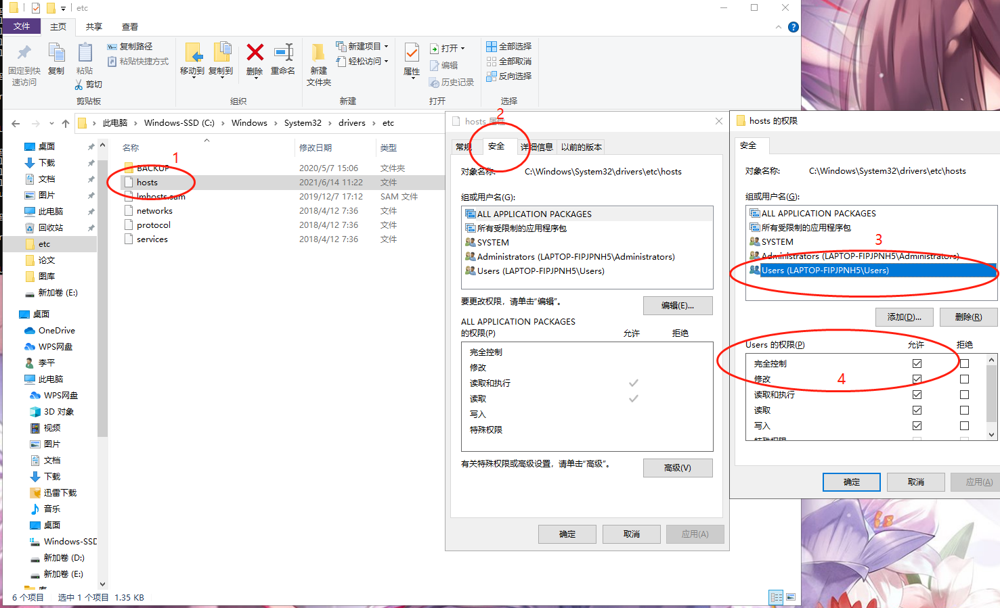

# UpdateHosts
### 0 前言

原理链接：http://mipha.site/2021/06/06/%e6%97%a0%e6%b3%95%e8%ae%bf%e9%97%aegithub%e8%a7%a3%e5%86%b3%e5%8a%9e%e6%b3%95/

由于访问Github经常会失败，所以写了一个脚本，专门更新Hosts中IP映射。

### 1 开启权限

注意本文争对Windows系统，需要打开Hosts的权限：

### 2 支持的功能

本脚本支持更新Hosts中的映射关系，如果之前不存在IP映射关系，自动支持添加。